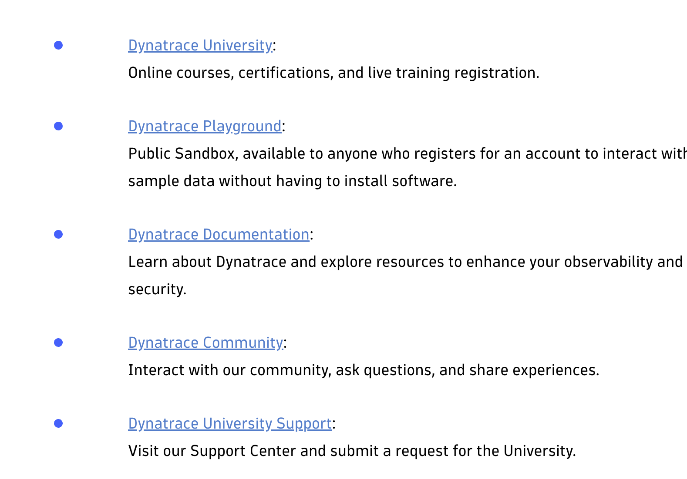

# Resources

## Exam topics

The exam tests proficiency across six critical areas of the platform:

- **Capabilities & Monitoring (24%)**: How Dynatrace gathers data and provides full-stack monitoring
- **Install & Configure (20%)**: Deploying OneAgent and ActiveGate, and configuring global system settings
- **Digital Experience Management (19%)**: Real User Monitoring (RUM) and Synthetic Monitoring to track end-user experiences
- **Reporting & Analysis (16%)**: Creating dashboards, using Smartscape, and interpreting data infographics
- **Problems & Resolution (13%)**: AI-powered (Davis AI) anomaly detection and root cause analysis
- **Components & Architecture (8%)**: Understanding system components and how they communicate

## New GUIDE Line

## Exam Structure

The updated exam is divided into two distinct parts taken in a single proctored session:

### Part 1: Theoretical

- **Questions:** Approximately 60 multiple-choice/multiple-response questions
- **Time Management:** Candidates are advised to complete this section in about 45 minutes to leave enough time for the labs

### Part 2: Practical (Labs)

- **Questions:** Approximately 16–18 hands-on tasks
- **Tasks:** Perform actions such as building DQL (Dynatrace Query Language) queries, setting up Synthetic monitors, and configuring Dashboards or Notebooks
- **Resources:** Official Dynatrace Documentation is permitted during this practical portion

## Key Practical Topics to Prepare

Based on community feedback and exam guides, focus on:

- **DQL Queries:** Writing queries for Grail to analyze logs and metrics
- **Dashboards & Notebooks:** Creating visualizations and analyzing data using the newer "Gen 3" apps
- **Digital Experience:** Setting up and configuring Real User Monitoring (RUM) and Synthetic monitors
- **Kubernetes & Services:** Navigating and analyzing performance for containerized environments

## Passing Requirements

- **Total Duration:** Usually around 3 hours (1 hour 45 minutes for theory + additional time for labs)
- **Score:** Combined score of 70% to 80% to pass, depending on the specific exam version

