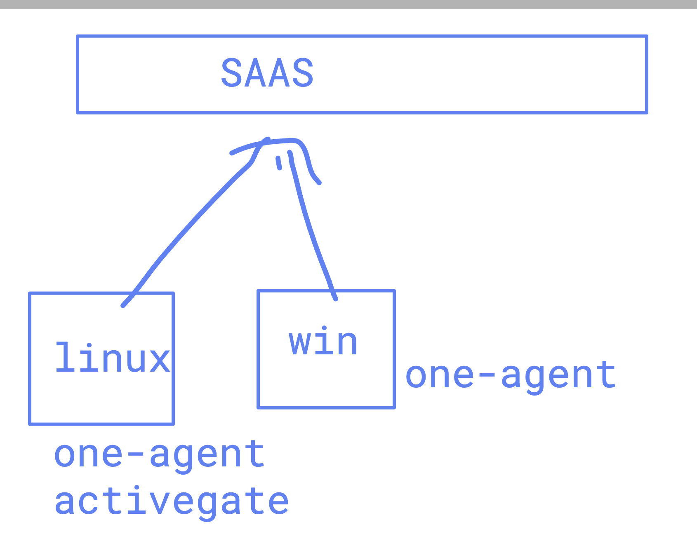

## Dynatrace Oneagent Monitoring Modes

# Discovery Modes

## Full-Stack Monitoring (Default)
Offers the complete scope of Dynatrace capabilities.

**Scope:** Infrastructure (CPU, RAM, disk, network) plus deep application-level monitoring.

**Features:** End-to-end transaction tracing (PurePath), code-level profiling, Real User Monitoring (RUM), and automated root cause analysis.

**Best For:** Business-critical applications requiring full observability and dependency mapping.

## Infrastructure Monitoring
Focuses on host-level health without deep code-level insights.

**Scope:** Host performance metrics, process analysis, and network metrics.

**Features:** Detects process-to-process communication and populates Smartscape topology. It automatically injects into processes for runtime metrics but does not provide tracing or profiling.

**Best For:** Supporting infrastructure like databases and message queues where code-level tracing is less critical.

## Foundation & Discovery Mode
A lightweight mode for basic monitoring at a lower cost.

**Scope:** Basic host health (CPU, memory, filesystem) and IT inventory.

**Features:** Provides topology discovery and host criticality. It does not include process analysis or deep metrics but can still integrate log management.

**Best For:** Low-priority hosts or large environments where only basic visibility and inventory management are needed.

## Labs to be completed --

