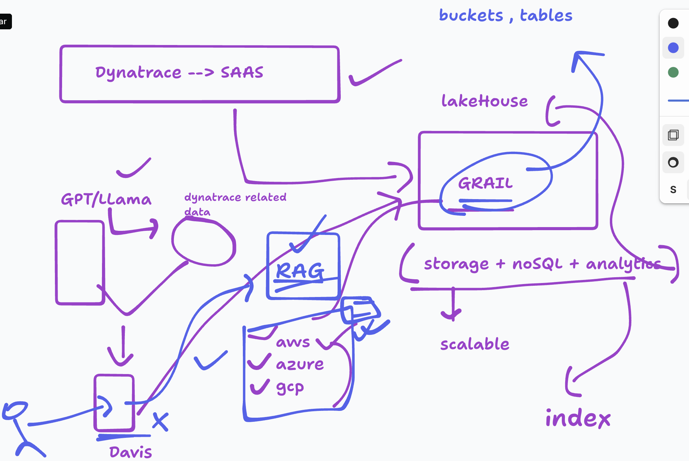
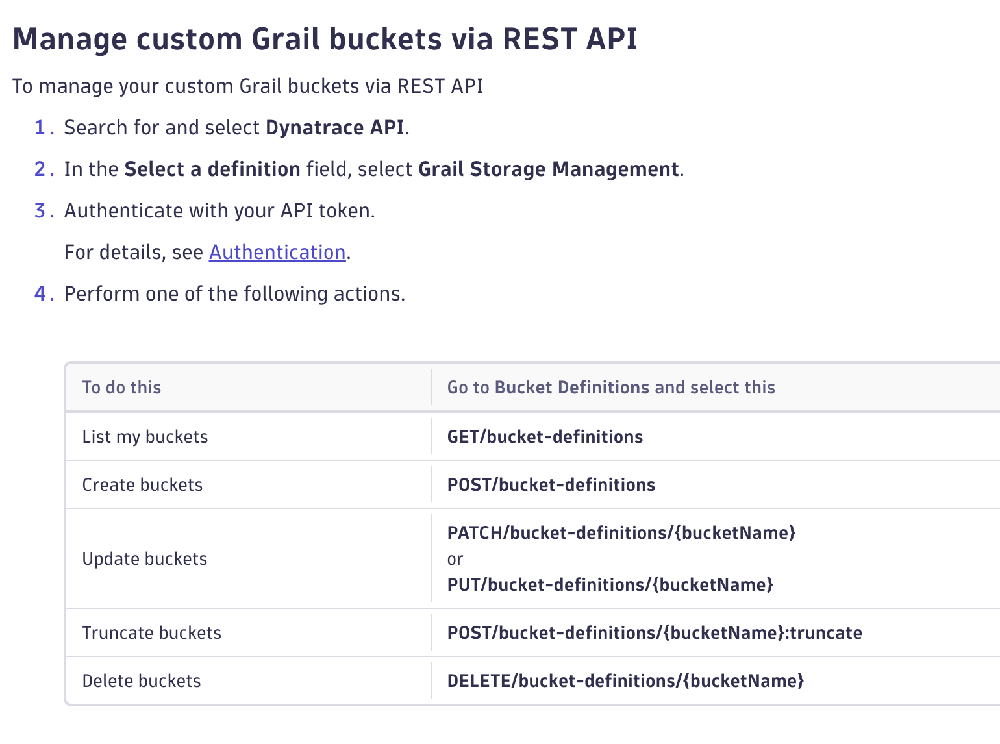
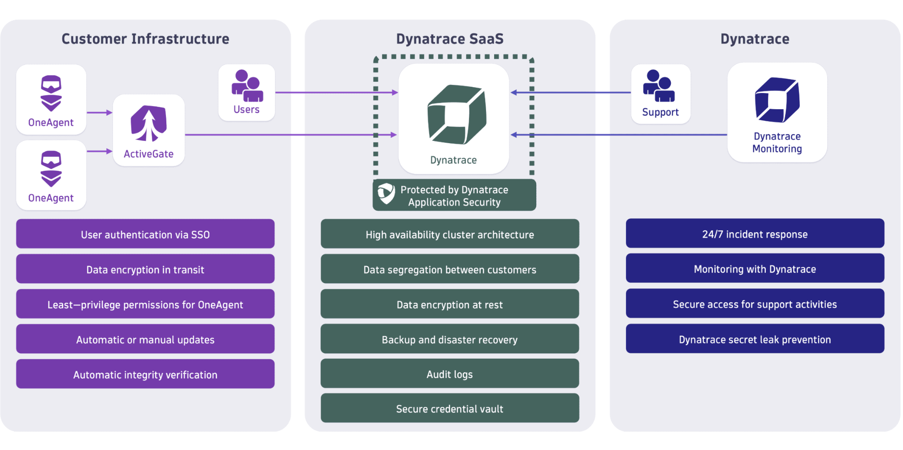
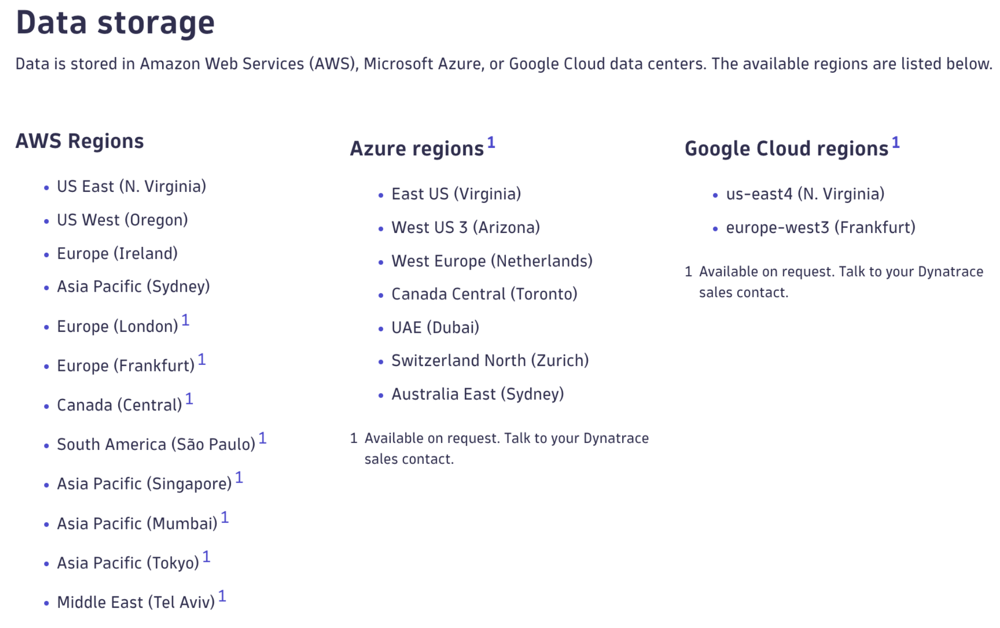

# Info about Grail



## Creating custom buckets using Dynatrace REST API



## Dynatrace Architecture



## Dynatrace Grail Storage options and locations in Cloud



## Checking status of agents

```bash
systemctl status oneagent
systemctl status dynatracegateway.service
```

### Dynatrace native command

```bash
./oneagentctl --version
1.333.55.20260317-092136
[root@ip-172-31-36-243 tools]# ./oneagentctl --get-server
{*https://ip-172-31-36-243.ec2.internal:9999/communication;https://172.31.36.243:9999/communication}{https://prod-ap-southeast-5-sydney-ap-southeast-2a.live.dynatrace.com/communication;https://prod-ap-southeast-5-sydney-ap-southeast-2b.live.dynatrace.com/communication;https://prod-ap-southeast-5-sydney-ap-southeast-2c.live.dynatrace.com/communication}{https://sg-ap-southeast-2-52-62-137-27-prod-ap-southeast-5-sydney.live.dynatrace.com/communication;https://sg-ap-southeast-2-13-55-162-49-prod-ap-southeast-5-sydney.live.dynatrace.com/communication;https://sg-ap-southeast-2-52-63-8-98-prod-ap-southeast-5-sydney.live.dynatrace.com/communication;https://sg-ap-southeast-2-13-55-101-144-prod-ap-southeast-5-sydney.live.dynatrace.com/communication;https://sg-ap-southeast-2-13-54-211-156-prod-ap-southeast-5-sydney.live.dynatrace.com/communication}{https://blg71138.live.dynatrace.com:443/communication}
[root@ip-172-31-36-243 tools]# ./oneagentctl --get-monitoring-mode
fullstack
```

#### History

```bash
cd /opt/dynatrace/
ls
cd oneagent/
ls
cd agent/
ls
cd tools/
ls
./oneagentctl --help
./oneagentctl --version
./oneagentctl --get-server
./oneagentctl --get-monitoring-mode
```

### Deploy flask webapp

- HTML, CSS, JS
- Python Flask

### Cloning code and installing Python3 libs

```bash
git clone https://github.com/redashu/resources.git

Cloning into 'resources'...
remote: Enumerating objects: 581, done.
remote: Counting objects: 100% (581/581), done.
remote: Compressing objects: 100% (407/407), done.
remote: Total 581 (delta 181), reused 460 (delta 104), pack-reused 0 (from 0)
Receiving objects: 100% (581/581), 6.66 MiB | 30.43 MiB/s, done.
Resolving deltas: 100% (181/181), done.


[root@ip-172-31-36-243 ~]# yum install python3-pip
Last metadata expiration check: 21:24:38 ago on Tue Mar 24 14:13:35 2026.
Dependencies resolved.
===============================================================================================================================================
 Package                             Architecture              Version                                    Repository                      Size
===============================================================================================================================================
Installing:
 python3-pip                         noarch                    21.3.1-2.amzn2023.0.16                     amazonlinux                    1.8 M
Installing weak dependencies:
 libxcrypt-compat                    x86_64                    4.4.33-7.amzn2023                          amazonlinux                     92 k

Transaction Summary


[root@ip-172-31-36-243 ~]# ls
Dynatrace-ActiveGate-Linux-x86-1.333.37.20260312-151000.sh  dt-root.cert.pem    html-sample-app
Dynatrace-OneAgent-Linux-x86-1.333.55.20260317-092136.sh    dt-root.cert.pem.1  resources

[root@ip-172-31-36-243 ~]# cd resources/
[root@ip-172-31-36-243 resources]# ls
Flask_chatUI  ansible-playbooks  compose-files  github-actions  ocp_manifests  terraform-tf
README.md     aws-cdk            dockerfiles    k8s-manifests   python_codes   webappss

[root@ip-172-31-36-243 resources]# cd Flask_chatUI/
[root@ip-172-31-36-243 Flask_chatUI]# ls
app.py  requirements.txt  static  templates
[root@ip-172-31-36-243 Flask_chatUI]# pip3 install -r requirements.txt
Collecting flask
   Downloading flask-3.1.3-py3-none-any.whl (103 kB)
Collecting openai==1.59.8
   Downloading openai-1.59.8-py3-none-any.whl (455 kB)


[root@ip-172-31-36-243 Flask_chatUI]# python3 app.py
 * Serving Flask app 'app'
 * Debug mode: on
WARNING: This is a development server. Do not use it in a production deployment. Use a production WSGI server instead.
 * Running on all addresses (0.0.0.0)
 * Running on http://127.0.0.1:5015
 * Running on http://172.31.36.243:5015
Press CTRL+C to quit
 * Restarting with stat
 * Debugger is active!
```

### Note user your public IP of ec2 machine 
http://yourip:5015

default user and password is admin/admin
